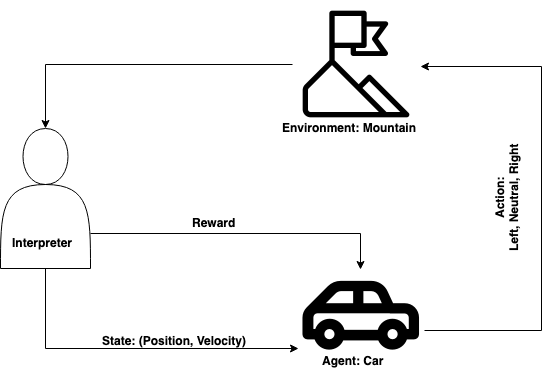
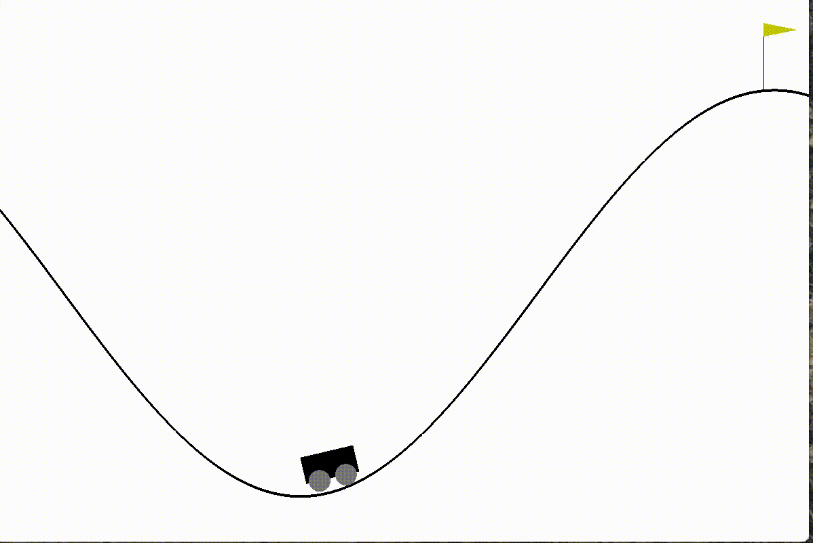
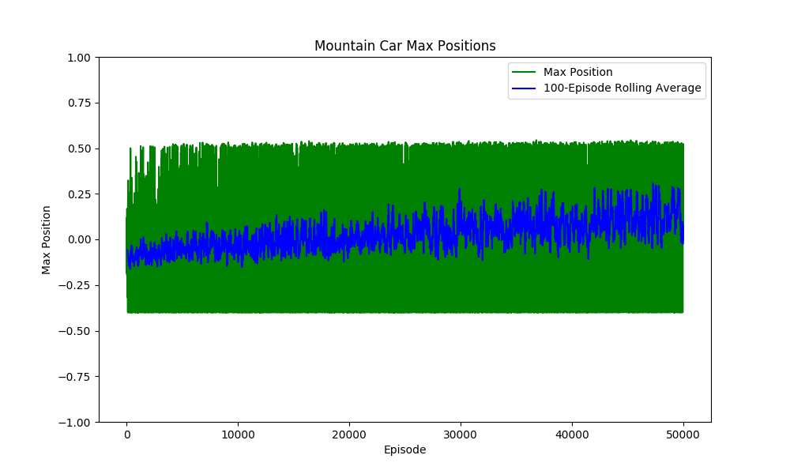

# Deep learning case study
## Authors: Matt Devor, Nathan James, Rosie Martinez & Neha Rao

## Table of Contents
* [The Goal](#The-Goal)
* [Background](#Background)
  * [The Environment](#The-Environment)
  * [The Actions](#The-Actions)
  * [The States](#The-States)
  * [Rewards](#Rewards)
  * [Policies](#Policies)
  * [Reward Table](#Reward-Table)
* [Naive Model](#Naive-Model)
  * [Naive Rewards](#Naive-Rewards)
  * [Naive Policy](#Naive-Policy)
* [Q-Table Model](#Q-Table-Model)
  * [The Q-Model Rewards](#The-Q-model-Rewards)
  * [Q-Model Policies](#Q-Model-Policies)
* [Keras Model](#Keras-Model)
* [The Results](#The-Results)
* [Final Thoughts & Next Steps](#Final-Thoughts)

## The Goal:
The goal of this case study was to use reinforcement learning to train an agent to perform well in an environment using the OpenAI Gym [source]/(https://gym.openai.com/envs/). Based on our time constraints, we chose to tackle one of the classic environments:

<p align="center">
  
</p>

Our goal was to see if we could train the actor in this given environment using reinforcement learning based on:
1. A naive model - random actions
2. A Q-table model - modified for rewards
3. A Keras model

[Return to Top](#Table-of-Contents)

## Background:

<p align="center">
  
</p>

[Return to Top](#Table-of-Contents)

##### The Environment:
This is the place where the agent lives and interacts with.

**For our case study, the environment is the mountain and our Actor (the car) is constrained to a 200 second episode**

##### The Actions:
Action is usually based on the environment, different environments lead to different actions based on the agent. Set of valid actions for an agent are recorded in a space called an action space. These are usually finite in number.

**Our actions were Left, Neutral, and Right**

##### The States:
The state is a complete description of the world, they don’t hide any pieces of information that is present in the world. It can be a position, a constant or a dynamic. We mostly record these states in arrays, matrices or higher order tensors.

**Our states were position and velocity**

<p align="center">
  
</p>

##### Rewards:
The reward function R is the one which must be kept tracked all-time in reinforcement learning. It plays a vital role in tuning, optimizing the algorithm and stop training the algorithm. It depends on the current state of the world, the action just taken, and the next state of the world.

##### Policies:
Policy is a rule used by an agent for choosing the next action, these are also called as agents brains.

##### Reward Table

For our case study, we realized that our states were based on two continuous variables:

|          	| Minimum 	| Maximum 	|
|----------	|---------	|---------	|
| Position 	| -1.2    	| 0.6     	|
| Velocity 	| -0.07   	| 0.07    	|

Due to the fact these were both continuous variables, we didn't want to have an overwhelming size of a reward table, so we decided to bin our position values by rounding to the nearest tenth position. For our velocity, we decided that it was informative if our velocity was either positive or negative, so we dichotomized that variable, ending up with 38 different states in our models.

[Return to Top](#Table-of-Contents)

## Naive Model:

#### Naive Rewards:
1. Multiply every second elapsed by -1
2. Positive reward if car reached the flag

#### Naive Policy:
Max reward at each state chosen based on cumulative reward table

The Naive Model selected randomly from the rewards table based on the maximum reward based on that state. (see reward table below). If two states had the same max value of reward, the actions were shuffled and one was chosen at random. As you can see, the reward didn't change too much from episode to episode and the max position never reached the flag position (0.6). From the short clip below, we can see that the model never really reached above a certain threshold in the environment and it just oscillated back and forth for the majority of the episodes. The rewards table below also reflect that, where we see clusters of negative rewards in two certain areas, but not much beyond that.


<p align="center">
  
  
  
</p>

The rewards table is below:

```

                          +--------------+----------+----------+----------+
                          |    STATE     |   LEFT   | NEUTRAL  |  RIGHT   |
                          +--------------+----------+----------+----------+
                          | ['0.6'  '+'] |   0.0    |   0.0    |   0.0    |
                          | ['0.5'  '+'] |   0.0    |   0.0    |   0.0    |
                          | ['0.4'  '+'] |   0.0    |   0.0    |   0.0    |
                          | ['0.3'  '+'] |   0.0    |   0.0    |   0.0    |
                          | ['0.2'  '+'] |   0.0    |   0.0    |   0.0    |
                          | ['0.1'  '+'] |   0.0    |   0.0    |   0.0    |
                          | ['0.0'  '+'] |   0.0    |   0.0    |   0.0    |
                          | ['-0.1' '+'] |   0.0    |   0.0    |   0.0    |
                          | ['-0.2' '+'] |   -7.0   |   -6.0   |   -6.0   |
                          | ['-0.3' '+'] |   0.0    |   0.0    |   0.0    |
                          | ['-0.4' '+'] | -2668.0  | -2667.0  | -2667.0  |
                          | ['-0.5' '+'] | -29396.0 | -29395.0 | -29396.0 |
                          | ['-0.6' '+'] |  -342.0  |  -343.0  |  -343.0  |
                          | ['-0.7' '+'] |   0.0    |   0.0    |   0.0    |
                          | ['-0.8' '+'] |   0.0    |   0.0    |   0.0    |
                          | ['-0.9' '+'] |   0.0    |   0.0    |   0.0    |
                          | ['-1.0' '+'] |   0.0    |   0.0    |   0.0    |
                          | ['-1.1' '+'] |   0.0    |   0.0    |   0.0    |
                          | ['-1.2' '+'] |   0.0    |   0.0    |   0.0    |
                          | ['0.6'  '-'] |   0.0    |   0.0    |   0.0    |
                          | ['0.5'  '-'] |   0.0    |   0.0    |   0.0    |
                          | ['0.4'  '-'] |   0.0    |   0.0    |   0.0    |
                          | ['0.3'  '-'] |   0.0    |   0.0    |   0.0    |
                          | ['0.2'  '-'] |   0.0    |   0.0    |   0.0    |
                          | ['0.1'  '-'] |   0.0    |   0.0    |   0.0    |
                          | ['0.0'  '-'] |   0.0    |   0.0    |   0.0    |
                          | ['-0.1' '-'] |   0.0    |   0.0    |   0.0    |
                          | ['-0.2' '-'] |   0.0    |   0.0    |   0.0    |
                          | ['-0.3' '-'] |   -5.0   |   -4.0   |   -5.0   |
                          | ['-0.4' '-'] | -2692.0  | -2692.0  | -2692.0  |
                          | ['-0.5' '-'] | -19683.0 | -19684.0 | -19683.0 |
                          | ['-0.6' '-'] | -11429.0 | -11430.0 | -11430.0 |
                          | ['-0.7' '-'] |  -445.0  |  -445.0  |  -445.0  |
                          | ['-0.8' '-'] |   0.0    |   0.0    |   0.0    |
                          | ['-0.9' '-'] |   0.0    |   0.0    |   0.0    |
                          | ['-1.0' '-'] |   0.0    |   0.0    |   0.0    |
                          | ['-1.1' '-'] |   0.0    |   0.0    |   0.0    |
                          | ['-1.2' '-'] |   0.0    |   0.0    |   0.0    |
                          +--------------+----------+----------+----------+

```

[Return to Top](#Table-of-Contents)

## Q-Table Model:

##### The Q-model Rewards:
1. Multiply every second elapsed by -1
2. Multiply absolute value of velocity by 1000 to reward higher velocities (max velocity = 0.07)
3. Add 10 to the reward when the maximum position of the episode exceeds the maximum position of the previous episode.


##### Q-Model Policies:
Our policies for Q-learning are based on the Bellman Equation:

<p align="center">
  
</p>


We had to boost the performance of the Q-learning model with extra rewards because there's no positive reinforcement using the Q-learning policies until the cart starts gaining momentum. It took a lot of adjustments to the number of episodes, the learning rate, and the rewards to finally get a model that successfully got to the goal post. We found that the ratio between the rewards for max_position and velocity really affected the performance of our model. We ended up with a 7% success rate after 50,000 episodes.

<p align="center">
  
  
</p>


Q-table is shown below:
```
                +--------------+---------+-----------+---------+
                |    STATE     |  LEFT   |  NEUTRAL  |  RIGHT  |
                +--------------+---------+-----------+---------+
                | ['0.6'  '+'] |   549   |    577    |   575   |
                | ['0.5'  '+'] |   571   |    561    |   576   |
                | ['0.4'  '+'] |   513   |    530    |   518   |
                | ['0.3'  '+'] |   494   |    485    |   511   |
                | ['0.2'  '+'] |   0.0   |    0.0    |   0.0   |
                | ['0.1'  '+'] |   436   |    447    |   467   |
                | ['0.0'  '+'] |   453   |    441    |   462   |
                | ['-0.1' '+'] |   0.0   |    0.0    |   0.0   |
                | ['-0.2' '+'] |   467   |    463    |   478   |
                | ['-0.3' '+'] |   0.0   |    0.0    |   0.0   |
                | ['-0.4' '+'] |   436   |    453    |   452   |
                | ['-0.5' '+'] |   424   |    428    |   446   |
                | ['-0.6' '+'] |   393   |    390    |   428   |
                | ['-0.7' '+'] |   378   |    405    |   378   |
                | ['-0.8' '+'] |   0.0   |    0.0    |   0.0   |
                | ['-0.9' '+'] |   384   |    388    |   389   |
                | ['-1.0' '+'] |   380   |    379    |   389   |
                | ['-1.1' '+'] |   356   |    356    |   359   |
                | ['-1.2' '+'] |   0.0   |    0.0    |   0.0   |
                | ['0.6'  '-'] |   0.0   |    0.0    |   0.0   |
                | ['0.5'  '-'] |   88.5  |    75.1   |   367   |
                | ['0.4'  '-'] |   273   |    270    |   265   |
                | ['0.3'  '-'] |   319   |    313    |   317   |
                | ['0.2'  '-'] |   352   |    349    |   349   |
                | ['0.1'  '-'] |   361   |    361    |   361   |
                | ['0.0'  '-'] |   361   |    361    |   360   |
                | ['-0.1' '-'] |   389   |    374    |   378   |
                | ['-0.2' '-'] |   384   |    388    |   380   |
                | ['-0.3' '-'] |   390   |    369    |   365   |
                | ['-0.4' '-'] |   394   |    369    |   367   |
                | ['-0.5' '-'] |   402   |    362    |   376   |
                | ['-0.6' '-'] |   403   |    369    |   366   |
                | ['-0.7' '-'] |   367   |    371    |   388   |
                | ['-0.8' '-'] |   364   |    374    |   361   |
                | ['-0.9' '-'] |   364   |    369    |   364   |
                | ['-1.0' '-'] |   350   |    346    |   354   |
                | ['-1.1' '-'] |   343   |    341    |   340   |
                | ['-1.2' '-'] |   342   |    342    |   342   |
                +--------------+---------+-----------+---------+
```

[Return to Top](#Table-of-Contents)

## Keras Model:

  ADD HERE

[Return to Top](#Table-of-Contents)

## The Results:

|                           	| Naive Model 	| Q-Table Model 	| Keras Model 	|
|---------------------------	|-------------	|---------------	|-------------	|
| Total number of episodes  	| 1000        	| 50,000        	|             	|
| Episode of first success  	| 0           	| 1264          	|             	|
| Total number of successes 	| 0           	| 3503          	|             	|

[Return to Top](#Table-of-Contents)

## Final Thoughts:

### Naive Model:

From the results that we see, it makes sense, in the sense that we aren't seeing much movement and that we see clusters of rewards happening in specific states. One of our limitations is that we did bin our states into custom bins, the ideal system would have kept the states as continuous, where we could try to implement either overlapping bins or used a function that could approximate our states for us, though we are not as equipped to do that at the moment. Even so, with the naive model, it is still picking randomly, so it would not make a large difference with the results we are seeing.

### Q-table:

We would need a lot more episodes to see a smoother curve when plotting episodes versus max position. Right now, the model is still having some difficulties in learning. With more time, we would be able to optimize our rewards system.  We could also apply a huge reward for successes, which might help the model learn faster. If our binning intervals were larger, we might have generated a better q-table with more clearly defined actions.

### Next Steps:
CHANGE IF NEEDED add more
The ideal next steps for us would be to optimize our models so we can have the actor learn in the minimum amount of episodes. It would also be interesting to examine different policies to see if the model would perform better.

[Return to Top](#Table-of-Contents)
