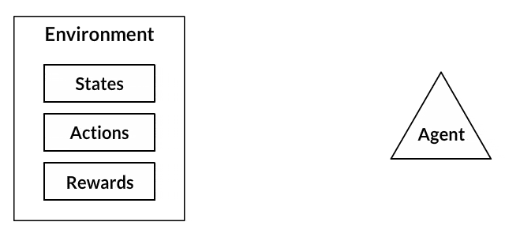
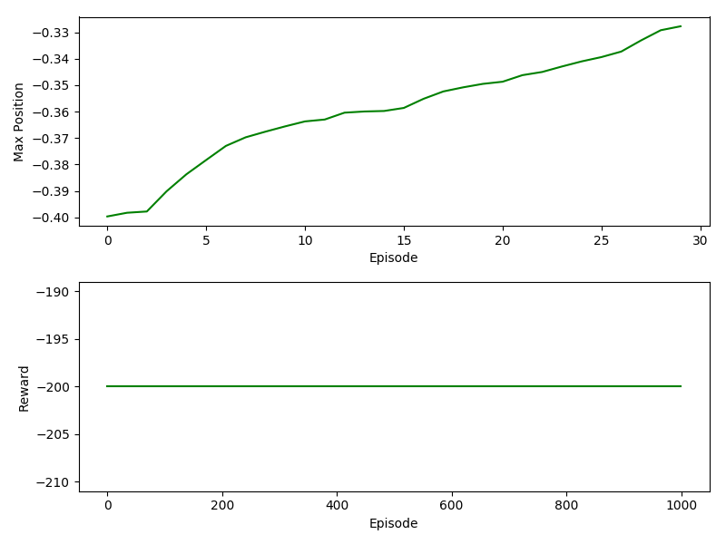
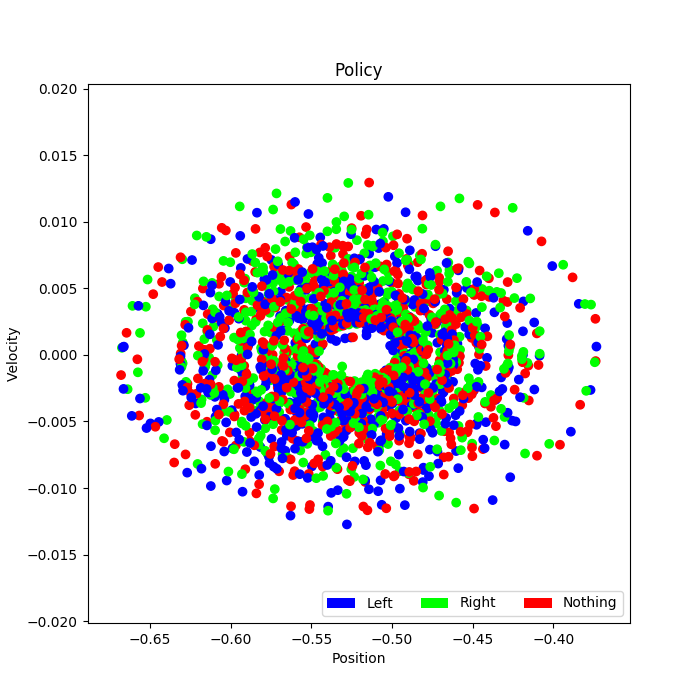

# Deep learning case study
## Authors: Matt Devor, Nathan James, Rosie Martinez & Neha Rao

## Table of Contents
* [The Goal](#The-Goal)
* [The Plan](#The-Plan)
* [Implementing our code](#Implementing-our-code)
  * [The Environment](#The-Environment)
  * [The Actions](#The-Actions)
  * [The States](#The-States)
  * [The Rewards](#The-Rewards)
  * [Q-Learning](#Q-learning)
  * [The Resulting Policy](#The-Resulting-Policy)
* [Our Model](#Our-model-in-action)
* [The Results](#The-Results)
* [Final Thoughts & Next Steps](#Final-Thoughts-&-Next-Steps)

## The Goal:
The goal of this case study was to use reinforcement learning to train an agent to perform well in an environment using the OpenAI Gym [source]/(https://gym.openai.com/envs/). Based on our time constraints, we chose to tackle one of the classic environments:

<p align="center">
  
</p>

## Background:

<p align="center">
  
</p>


##### The Environment:
This is the place where the agent lives and interacts with.

**For our case study, the environment is the mountain.**

##### The Actions:
Action is usually based on the environment, different environments lead to different actions based on the agent. Set of valid actions for an agent are recorded in a space called an action space. These are usually finite in number.

**Our actions were Left, Neutral, and Right**

##### The States:
The state is a complete description of the world, they don’t hide any pieces of information that is present in the world. It can be a position, a constant or a dynamic. We mostly record these states in arrays, matrices or higher order tensors.

**Our states were position and velocity**

##### The Rewards:
The reward function R is the one which must be kept tracked all-time in reinforcement learning. It plays a vital role in tuning, optimizing the algorithm and stop training the algorithm. It depends on the current state of the world, the action just taken, and the next state of the world.

**Our rewards for Q-learning are:
    1) Multiply every second elapsed by -1
    2) Multiply absolute value of velocity by 1000 to reward higher velocities (max velocity = 0.07)
    3) Add 10 to the reward when the maximum position of the episode exceeds the maximum position of the previous episode. 
    ****

##### Policies:
Policy is a rule used by an agent for choosing the next action, these are also called as agents brains.
For Q-learning, we use the Bellman Equation:
<p align="center">
  
</p>

**Our policies for Q-learning are based on the following equation:**

##### Reward Table or Q-Table (depending on model):
For our case study, we realized that our states were based on two continuous variables:

                                |          	| Minimum 	| Maximum 	|
                                |----------	|---------	|---------	|
                                | Position 	| -1.2    	| 0.6     	|
                                | Velocity 	| -0.07   	| 0.07    	|

Due to the fact these were both continuous variables, we didn't want to have an overwhelming size of a reward table, so we decided to bin our position values by rounding to the nearest tenth position. For our velocity, we decided that it was informative if our velocity was either positive or negative, so we dichotomized that varible, ending up with 38 different states in our models.

## Naive Model:
The Naive Model randomly from the rewards table based on the maximum reward based on that state. (see reward table below). If two states had the same max value of reward, the actions were shuffled and one was chosen at random.

<p align="center">
  
  
</p>

```

                                +--------------+--------+---------+--------+
                                |    STATE     |  LEFT  | NEUTRAL | RIGHT  |
                                +--------------+--------+---------+--------+
                                | ['0.6' '+']  |  0.0   |   0.0   |  0.0   |
                                | ['0.5' '+']  |  0.0   |   0.0   |  0.0   |
                                | ['0.4' '+']  |  0.0   |   0.0   |  0.0   |
                                | ['0.3' '+']  |  0.0   |   0.0   |  0.0   |
                                | ['0.2' '+']  |  0.0   |   0.0   |  0.0   |
                                | ['0.1' '+']  |  0.0   |   0.0   |  0.0   |
                                | ['0.0' '+']  |  0.0   |   0.0   |  0.0   |
                                | ['-0.1' '+'] |  0.0   |   0.0   |  0.0   |
                                | ['-0.2' '+'] |  0.0   |   0.0   |  0.0   |
                                | ['-0.3' '+'] |  0.0   |   0.0   |  0.0   |
                                | ['-0.4' '+'] | -20.0  |  -21.0  | -21.0  |
                                | ['-0.5' '+'] | -292.0 |  -292.0 | -293.0 |
                                | ['-0.6' '+'] |  -3.0  |   -3.0  |  -4.0  |
                                | ['-0.7' '+'] |  0.0   |   0.0   |  0.0   |
                                | ['-0.8' '+'] |  0.0   |   0.0   |  0.0   |
                                | ['-0.9' '+'] |  0.0   |   0.0   |  0.0   |
                                | ['-1.0' '+'] |  0.0   |   0.0   |  0.0   |
                                | ['-1.1' '+'] |  0.0   |   0.0   |  0.0   |
                                | ['-1.2' '+'] |  0.0   |   0.0   |  0.0   |
                                | ['0.6' '-']  |  0.0   |   0.0   |  0.0   |
                                | ['0.5' '-']  |  0.0   |   0.0   |  0.0   |
                                | ['0.4' '-']  |  0.0   |   0.0   |  0.0   |
                                | ['0.3' '-']  |  0.0   |   0.0   |  0.0   |
                                | ['0.2' '-']  |  0.0   |   0.0   |  0.0   |
                                | ['0.1' '-']  |  0.0   |   0.0   |  0.0   |
                                | ['0.0' '-']  |  0.0   |   0.0   |  0.0   |
                                | ['-0.1' '-'] |  0.0   |   0.0   |  0.0   |
                                | ['-0.2' '-'] |  0.0   |   0.0   |  0.0   |
                                | ['-0.3' '-'] |  0.0   |   0.0   |  0.0   |
                                | ['-0.4' '-'] | -21.0  |  -21.0  | -22.0  |
                                | ['-0.5' '-'] | -211.0 |  -211.0 | -210.0 |
                                | ['-0.6' '-'] | -114.0 |  -114.0 | -114.0 |
                                | ['-0.7' '-'] |  -4.0  |   -4.0  |  -5.0  |
                                | ['-0.8' '-'] |  0.0   |   0.0   |  0.0   |
                                | ['-0.9' '-'] |  0.0   |   0.0   |  0.0   |
                                | ['-1.0' '-'] |  0.0   |   0.0   |  0.0   |
                                | ['-1.1' '-'] |  0.0   |   0.0   |  0.0   |
                                | ['-1.2' '-'] |  0.0   |   0.0   |  0.0   |
                                +--------------+--------+---------+--------+

```


## Q-Table Model:
Sorry for the insane amount of sig figs!
'''
     +--------------+--------------------+--------------------+--------------------+
|    STATE     |        LEFT        |      NEUTRAL       |       RIGHT        |
+--------------+--------------------+--------------------+--------------------+
| ['0.6' '+']  | 548.9971446490777  | 576.5057979522169  | 574.6780281163476  |
| ['0.5' '+']  | 571.2330362754537  | 560.5095868265125  | 575.9451399290822  |
| ['0.4' '+']  | 513.1135744521157  | 529.8474224663217  | 517.5524774424146  |
| ['0.3' '+']  | 494.3331855943739  | 485.3466961153983  | 510.99493922534083 |
| ['0.2' '+']  |        0.0         |        0.0         |        0.0         |
| ['0.1' '+']  | 436.04087033084124 | 447.0659531743777  | 466.9599046853296  |
| ['0.0' '+']  | 452.87619282680714 |  441.362427442717  | 461.60347821130506 |
| ['-0.1' '+'] |        0.0         |        0.0         |        0.0         |
| ['-0.2' '+'] | 467.1943368153936  | 462.8806039553389  | 478.40701538798106 |
| ['-0.3' '+'] |        0.0         |        0.0         |        0.0         |
| ['-0.4' '+'] | 435.51026412121655 | 452.6541078778832  | 452.4305873655485  |
| ['-0.5' '+'] | 424.1814925887359  | 428.1465685005734  | 446.09256146690774 |
| ['-0.6' '+'] | 392.76428011345615 | 389.63776058659806 | 428.2846898143349  |
| ['-0.7' '+'] | 373.82069691073315 | 405.3766693181643  | 378.25200230319473 |
| ['-0.8' '+'] |        0.0         |        0.0         |        0.0         |
| ['-0.9' '+'] | 384.4547066792598  | 387.87987935773253 | 388.59616365550903 |
| ['-1.0' '+'] | 379.9534912979969  | 379.3532955345815  |  389.262379709546  |
| ['-1.1' '+'] | 355.87672905291527 | 355.87032692489197 | 358.98662964756187 |
| ['-1.2' '+'] |        0.0         |        0.0         |        0.0         |
| ['0.6' '-']  |        0.0         |        0.0         |        0.0         |
| ['0.5' '-']  | 88.46267749699246  | 75.09285179279519  |  366.968959416608  |
| ['0.4' '-']  | 272.85740307744646 | 269.7842347466606  | 265.2353856162637  |
| ['0.3' '-']  | 318.9282978505713  | 313.43910894817077 | 316.60355403805784 |
| ['0.2' '-']  | 351.87732585868997 | 349.01523838788785 | 348.95108533954436 |
| ['0.1' '-']  | 361.4388715477062  | 361.2865760650327  | 361.37036783938856 |
| ['0.0' '-']  | 360.55153538300016 | 361.10675892593247 | 360.2566709897605  |
| ['-0.1' '-'] | 388.6031450240315  | 374.19651038183616 | 377.9776251890719  |
| ['-0.2' '-'] | 384.0224104570518  | 388.39683571935774 | 379.7762612553105  |
| ['-0.3' '-'] | 389.62522227000215 | 369.1625449425758  | 364.67951581592484 |
| ['-0.4' '-'] | 393.57797513875477 | 369.43981709431233 | 367.1208051865905  |
| ['-0.5' '-'] | 402.06624590962474 | 361.58732520084544 | 375.9930178548676  |
| ['-0.6' '-'] | 402.8697962007092  | 369.1690554073903  | 366.1369839017384  |
| ['-0.7' '-'] | 366.5378706323235  | 371.1805245424065  | 387.70991557836345 |
| ['-0.8' '-'] | 363.86664545945075 | 373.64671801696215 | 361.0237201418583  |
| ['-0.9' '-'] | 363.5460046317455  |  369.334969809631  |  363.765356654322  |
| ['-1.0' '-'] | 349.5686370057344  | 345.9520950096152  | 353.88888971923353 |
| ['-1.1' '-'] | 343.2727997861625  | 340.90611946838345 |  340.435087065668  |
| ['-1.2' '-'] | 341.59170879491273 | 341.7640692608056  | 342.0490990436949  |
+--------------+--------------------+--------------------+--------------------+
'''
## Keras Model:
   3. What architecture you chose and why
   4. What final architecture you chose and why (how did you pick your hyperparameters?)


## The Results:

|                           	| Naive Model 	| Q-Table Model 	| Keras Model 	|
|---------------------------	|-------------	|---------------	|-------------	|
| Average Reward            	| -200        	|               	|             	|
| Total number of episodes  	| 1000        	| 30,000        	|             	|
| Episode of first success  	| 0           	| 1264          	|             	|
| Total number of successes 	| 0           	| 1069          	|             	|

## Final Thoughts & Next Steps:

### Q-table:

We would need a lot more episodes to see a smoother curve when plotting edisodes versus max posiiton. Right now, the model is still having some difficulties in learning. With more time, we would be able to optimize our rewards system. We found that the ratio between the rewards for max_position and velocity really affected the performance of our model. We could also apply a huge reward for successes, which might help the model learn faster. 
