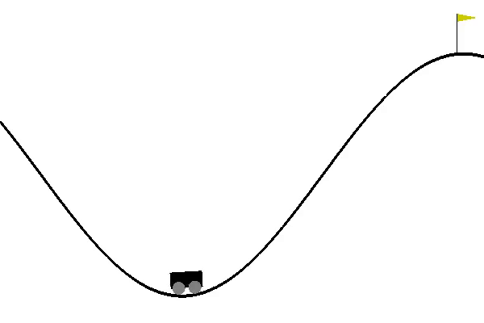

# Deep learning case study
## Authors: Matt Devor, Nathan James, Rosie Martinez & Neha Rao

## Table of Contents
* [The Goal](#The-Goal)
* [The Plan](#The-Plan)
* [Implementing our code](#Implementing-our-code)
  * [The Environment](#The-Environment)
  * [The Actions](#The-Actions)
  * [The States](#The-States)
  * [The Rewards](#The-Rewards)
  * [Q-Learning](#Q-learning)
  * [The Resulting Policy](#The-Resulting-Policy)
* [Our Model](#Our-model-in-action)
* [The Results](#The-Results)
* [Final Thoughts & Next Steps](#Final-Thoughts-&-Next-Steps)

## The Goal:
The goal of this case study was to use reinforcement learning to train an agent to perform well in an environment using the OpenAI Gym [source]/(https://gym.openai.com/envs/). Based on our time constraints, we chose to tackle one of the classic environments: 

  

## The Plan:
   1. Talk about what you planned to accomplish
   2. How you organized yourselves as a team

## Implementing our code:
   3. What architecture you chose and why
   4. What final architecture you chose and why (how did you pick your hyperparameters?)
#### The Environment:

#### The Actions:

#### The States:

#### The Rewards:

#### Q-learning:

#### The Resulting Policy:

## Our model in action:
*potentailly input a video or gif of our model working*

## The Results:
   5. How measured your model's performance

## Final Thoughts & Next Steps:

   6. Things learned along the way.

